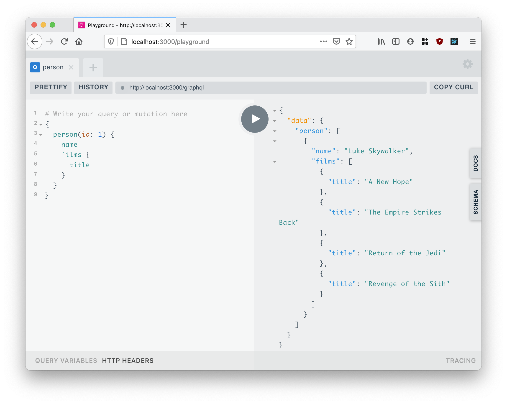
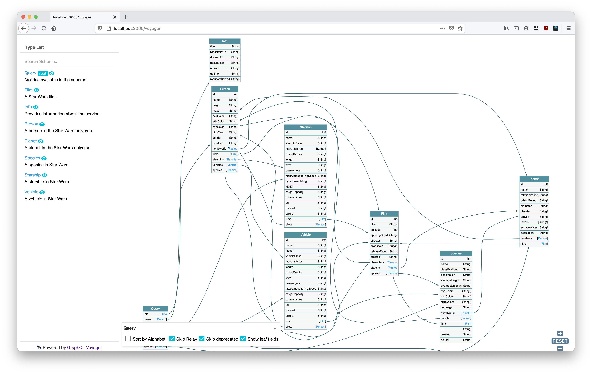

# SWAPIQL

A GraphQL wrapper for the [SWAPI REST API](https://swapi.dev/).


## Introduction

This repo is a proxy GraphQL wrapper service for the SWAPI REST API enabling the community to access their Star War trivia in GraphQL format. It is written in Go and has an associated [Docker image](https://hub.docker.com/r/jgopsill/swapiql) for people to pull and run on their own platforms.

Now there is no need to access multiple endpoints and synthesise your Star Wars data. SWAPIQL has you covered. Just ask it what data you want and off it will go to get it for you.

The container exposes port `3000` and the GraphQL endpoint is at the root (i.e. `localhost:3000/graphql`). The server also provides GraphQL Playground and Voyager at `localhost:3000/playground` and `localhost:3000/voyager`, respectively. These are pre-configured to work with the container's GraphQL endpoint.




### Serving at a different endpoint

If you want to use a different endpoint other than the root endpoint then you can create a environment variable called `GQL_PREFIX` and add the prefix that appends to the root. E.g. `localhost:3000/swapiql/[graphql|playground|voyager]` will use `GQL_PREFIX=/swapiql`.

### Logging

Zerolog is used for logging in the code and defaults to logging info information. This can be changed to log debug information using the `GQL_DEBUG=true` environment variable.

### Response cache

Go-cache is used to provide url response caching to reduce the number of repeated calls to the REST API.

### Useful commands

1. To run the the docker image

```
docker run -p 3000:3000 jgopsill/swapiql
```

2. To run the code, pull repo and run

```
go run main.go
```

3. Running the code in debug mode

```
GQL_DEUBUG=true go run main.go
```

4. Building the docker image

```
DOCKER_BUILDKIT=1 docker build --tag swapiql .
```

N.b. `DOCKER_BUILDKIT` env var removes the intermediate images after build.

### TODO

- ~~Finish wrapper first parse~~
- ~~Document the schema~~
- ~~Add search~~
- ~~Caching~~
- Testing and errors

## Useful links

- [Google Distroless Containers](https://github.com/GoogleContainerTools/distroless)
- [Creating small and secure golang images](https://medium.com/@chemidy/create-the-smallest-and-secured-golang-docker-image-based-on-scratch-4752223b7324)
- [GraphQL Gophers](https://github.com/graph-gophers/graphql-go)
- [SWAPI - The Star Wars API](https://swapi.dev/)
- [GraphQL](https://graphql.org/)
- [Docker BuildKit](https://docs.docker.com/develop/develop-images/build_enhancements/)
- [Watchtower](https://containrrr.dev/watchtower/)
- [Zerolog](https://github.com/rs/zerolog)
- [go-cache](https://github.com/patrickmn/go-cache)
- [GraphQL Playground](https://github.com/graphql/graphql-playground)
- [GraphQL Voyager](https://github.com/APIs-guru/graphql-voyager)

